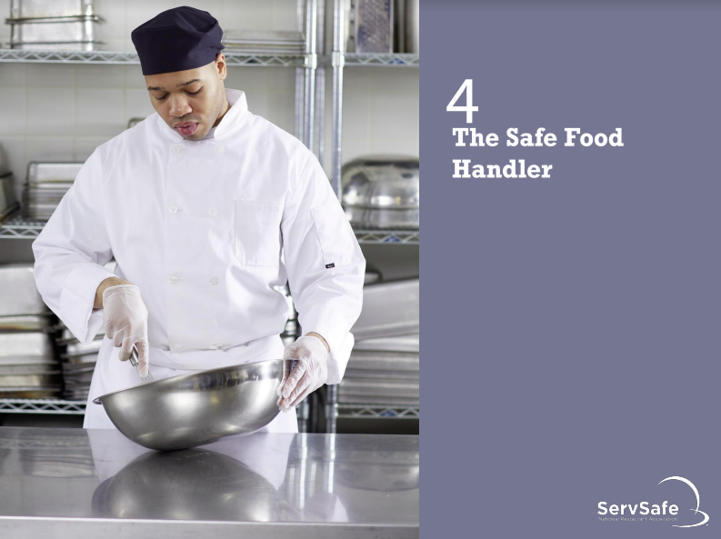
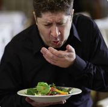
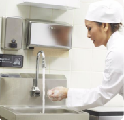
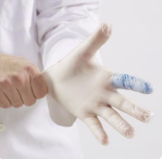
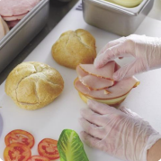

# Culinary ServSafe Ch. 4

## How Food Handlers Can Contaminate Food
### Situations that can lead to contaminating food:
- Have a foodborne illness
- Have wounds or boils that contain a pathogen
- Sneeze or cough
- Have contact with a person who is sick
- Use the restroom and do not wash their hands
- Have symptoms such as diarrhea, vomiting, or
jaundice—a yellowing of the eyes or skin
---
### Actions that can contaminate food
- Scratching the scalp
- Running fingers through hair
- Wiping or touching the nose
- Rubbing an ear
- Touching a pimple or infected wound
- Wearing a dirty uniform
- Coughing or sneezing into the hand
- Spitting in the operation
---

## Diseases Not Transmitted through Food
### When staff have HIV/AIDS, tuberculosis, or Hepatitis B or C:
- Americans with Disabilities Act (ADA) provides employees with civil-rights protections.
  - Employees cannoy he fired or transferred because of their disease
- Employers must maintain the confidentiality of any staff who have an illness that is not foodborne
---
## A Good Personal Hygiene Program
### Managers must focus on the following:
- Creating personal hygiene policies
- Training food handlers on personal hygiene policies and retraining them regularly
- Modeling correct behavior at all times
- Supervising food safety practices
- Revising personal hygiene policies when laws or science change
---
## Handwashing
### Where to wash hands:
- Wash hands in a sink designated for handwashing
- **NEVER** was hands in sinks designated for food prep or dishwashing or sinks used for disguarding waste water.
### Avoid contaminating clean hands:
- Consider using a paper towel to turn off the faucet and to open the door.
### When to wash hands:

### Food handlers must wash their hands *before*:
- Preparing food
- Working with clean equiment
- Putting on single-use gloves
### Food handlers must wash their hands *after*:
- Using the restroom
- Touching the body or clothing
- Coughting, sneezing, blowing nose, or using a handkercheif/tissue
- Eating, drinking, smoking, or chewing gum or tobacco
- Handling soiled items
Handling raw meat, seafood, or poultry
- Taking out garbage
- Handling service or aquatic animals
- Handling chemicals that might affect food
safety
- Changing tasks (before beginning new task)
- Leaving and returning to the kitchen/prep area
- Handling money
- Using electronic devices
- Touching anything that may contaminate hands
### Corrective action:
### If food handlers have touched food or food-contact surfaces with unclean hands:
- Dispose of the contaminated food.
- Clean potentially contaminated equipment and utensils.
- Retrain or coach food handlers who are not following the correct handwashing procedures if necessary.
### Hand antiseptics:
- Liquids or gels used to lower the number
of pathogens on skin
### If used, hand antiseptics:
- Must comply with the CFR and
FDA standards
- Should be used only after handwashing
- Must **NEVER** be used in place of handwashing
- Should be allowed to dry before touching food or equipment
---
## Infected Wounds or Cuts
### Infected wounds, cuts, or boils:
- Contain pus.
- Must be covered if they are open or draining.

### How a wound is covered depends on where it is located:
- Hand or wrist—Cover wounds with an impermeable cover, (e.g., bandage or finger cot) and then a single-use glove.
- Arm—Cover wounds with an impermeable cover, such as a bandage.
- Other part of the body—Cover wounds with a dry, tight-fitting bandage.
---
## Bare-Hand Contact with Ready-to-Eat Food
### *NEVER* handle ready-to-eat food with bare hands when you primarily serve a high-risk population.
### Avoid bare-hand contact with ready-to-eat food *unless*:
- The food is an ingredient in a dish that does not contain raw meat, seafood, or poultry and
  - The dish will be cooked to at least 145 ̊F (63 ̊C)

- The food is an ingredient in a dish containing raw meat, seafood, or poultry and
  - The dish will be cooked to the required minimum internal temperature of the raw item(s)
---
## Single-Use Gloves
- Must **NEVER** be used in place of handwashing
- Should be used when handling ready-to-eat food
  - Except when washing produce
  Except when handlign ready-to ear ingredients for a dish that will be cooked to the correct internal temperature

