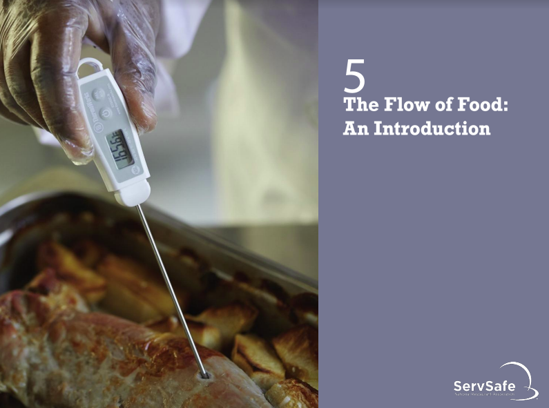
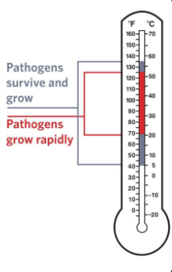
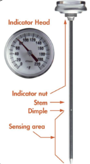
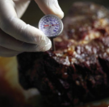

# Culinary ServSafe Ch. 5

## Cross-Contamination
### Separate equipment:
- Use separate equipment for raw and
ready-to-eat food.
### Clean and sanitize:
- Clean and sanitize all work surfaces,
equipment, and utensils before and after each task.
### Prep raw and ready-to-eat food at different times:
- If using the same prep table, prep raw meat, fish, and poultry at a different time than ready-to-eat food.
- When possible, prep ready-to-eat food before raw food.
### Buy prepared food:
- Buy food items that don’t require much prepping or handling.
---
## Time-temperature control:

- Food held in the range of 41 ̊F and 135 ̊F
(5 ̊C and 57 ̊C) has been time-temperature
abused.
- Food is being temperature abused whenever it is handled in the following ways.
  - Cooked to the wrong internal temperature
  - Held at the wrong temperature
  - Cooked or reheated incorrectly
### Avoid time-temperature abuse:
- Monitor time and temperature.
- Make sure the correct kinds of thermometers are available.
- Regularly record temperatures and the times they are taken.
- Minimize the time that food spends in the temperature danger zone.
- Take corrective actions if time-temperature standards are not met.
--- 
## Monitoring Time and Temperature

### Bimetallic stemmed thermometer:
- Measures temperature through a metal stem
- Has a sensing area from the tip to the dimple
  - The entire sensing area must be inserted into
the food
- Has a calibration nut to keep the thermometer
accurate
### Thermocouples and thermistors:
- Measure temperature through a metal probe
- Display temperatures digitally
- Have a sensing area on the tip of their probe
- Come with interchangeable probes
  - Immersion probe
  - Surface probe
  - Penetration probe
  - Air probe
### Infrared (laser) thermometers:
- Used to measure the surface temperature of
food and equipment.
- Hold as close to the food or equipment as
possible.
- Remove anything between the thermometer
and the food, food package, or equipment.
- Follow manufacturers’guidelines.
### Maximum registering thermometer:
- Indicates the highest temperature reached
during use
- Used where temperature readings cannot
be continuously observed
### Time-temperature indicators (TTI):
- Monitor both time and temperature
- Are attached to packages by the supplier
- A color change appears on the device when
time-temperature abuse has occurred
--- 
## How to Calibrate Thermometers
### Calibration:
- Adjusting a thermometer to get a correct reading
### Two methods:
- Ice-point method
  1. Fill a large container with
ice, and add tap
water.
  2. Submerge the sensing
area and wait 30
seconds.
  3. Adjust the thermometer
so it reads 32oF (0oC).
- Boiling-point method
  1. Bring tap water to a boil
in a deep pan.
  2. Put the thermometer stem or probe into the water.
  3. Adjust the thermometer so it reads 212oF
(100oC) or the boiling point for your elevation.
---
## General Thermometor Guidelines
### When using thermometers:
- Wash, rinse, sanitize, and air- dry thermometers before and after using them.
- Calibrate them at these times:
  - After they have been bumped or dropped
  - After they have been exposed to extreme
temperature changes
  - Before deliveries arrive
  - Before each shift

### When using thermometers:
- Make sure they are accurate.
  - If used to check food, thermometers must be
accurate to +/- 2 ̊F or +/- 1 ̊C.
  - If used to check air temperature, thermometers
must be accurate to +/- 3 ̊F or +/- 1.5 ̊C.
- Only use glass thermometers if they are
enclosed in a shatterproof casing.
- Insert the thermometer stem or
probe into thickest part of the food.
- Take more than one reading in different spots.
- Wait for the thermometer reading to steady.

