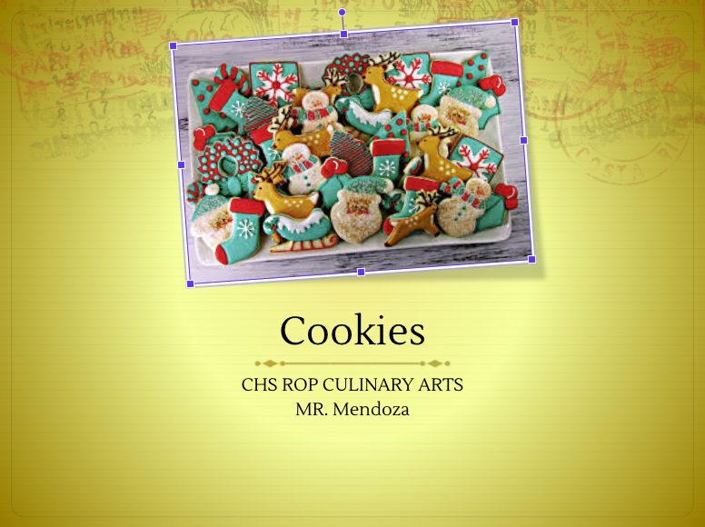
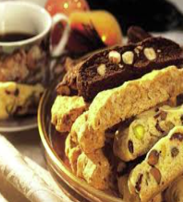
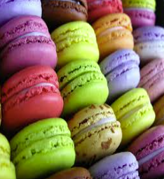
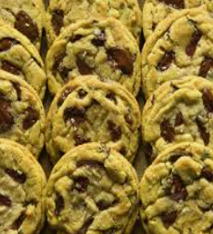
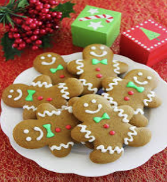
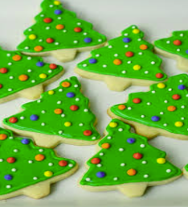
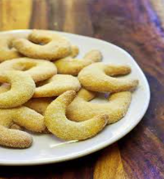
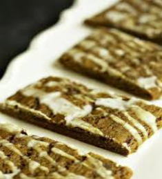

## Cookies are:

- Small desserts that can be crisp, soft, or chewy and come in many shapes
- Served in quick-service and family-style restaurants as well as in cafes where they may be served beside a dish of ice cream
- Almost any crunchy or flavorful ingredient, from candy to fruit to nuts, can turn basic cookie dough into a special dessert
- Classified according to their texture.  They can be crisp, soft, or chewy
- Sometimes, the texture of a cookie, such as a chocolate chip cookie, is a matter of personal taste.  Some people prefer them soft and chewy, while others prefer them crispy
- It is important to know the various types of cookies so that you can get the texture you want

## Crisp Cookies

- Most are made from stiff dough, without much liquid in the mix.
- Have a high ratio of sugar.
- Spread more than other cookies during the baking process because of the greater amount of sugar.
- Are thin and dry faster.
- Must be stored in an air tight container without refrigeration.

## Soft Cookies

- Have low amounts of fat and sugar in the batter, and a high proportion of liquid, such as eggs.
- Corn syrup, molasses, or honey is often used along with granulated sugar, because they retain their moisture after baking providing a soft texture.  
- Finished baking when bottoms and edges turn a light golden brown.
- Must be stored in an airtight container without refrigeration.

## Chewy Cookies

- Need a high ratio of eggs, sugar, and liquid, but a low amount of fat.
- The gluten in the flour must develop during the mixing stage, to achieve a chewy cookie.
- Gluten provides both stretch and flexibility to the cookie, which makes it chewy.
- Pastry flour is ideal for cookie production.

## Cookie spread
### The spread of cookies is determined by 6 factors:
- Flour Type – pastry flour is used in cookies for its medium gluten content.  This creates the proper spread.
- Sugar Type – granulated sugar provides the right amount of spread.  If a finer grain of sugar is used, such as confectioner’s sugar, the cookie will spread less.
- Amount of Liquid – a cookie dough with a high amount of liquid, such as eggs, will have more spread.  For reduced spread, reduce the amount of eggs in the recipe.
- Baking Soda – in a cookie dough, the baking soda promotes the proper spread by relaxing the gluten.  Baking soda is used as a leavening agent when it is combined with liquid and an acid.
- Fat Type – The type of fat used in cookie dough also affects the spread of the cookie.  When butter or margarine is used, more spread is created.  When all-purpose shortening is used, less spread is created.
- Baking Temperatures – oven temperatures that are too low cause excessive spread.  Oven temperatures that are too high give little or no spread.

## Making cookies
- Most cookie doughs contain the same ingredients.  Sugar, fat, eggs, flour, baking soda, and leavening agents, such as baking powder are mixed together in varying amounts.  Additional ingredients such as chocolate, nuts, or fruits, may also be added.
- When making cookies, you must determine the appropriate mixing type.  The type of cookie that you make determines the mixing method you will use.

## Mixing Methods
### One-stage method:
- All ingredients are mixed in a single stage.  All ingredients should be at room temperature and accurately measured.
- Follow these steps:
1. Put all ingredients in the mixer.
2. Mix at a low speed using the paddle attachment.  It will usually take 2 to 3 minutes to blend the dough.
3. Scrape down the sides of the bowl with a spatula as necessary to be sure all the ingredients are well blended.

### Creaming Method:
- The most common method for mixing cookie dough.
- Creaming together the sugar and the fat makes a smooth mixture, because air has been beaten into the fat and sugar cells.  The air cells expand, lightening the texture of the cookies while they bake.
- Excessive creaming will cause a cookie to spread too much while it bakes. 
- Follow these steps:
1. Using the paddle attachment on the mixer, lightly cream the sugar, fat, flavorings, and salt together.  
2. After creaming, add eggs in stages, to allow for their proper absorption into the mixture.  Mix at a low speed.
3. In a separate bowl, sift flour and other dry ingredients together.
4. Then, add dry ingredients to the creamed mixture and continue to mix at a low speed until the dry ingredients are incorporated.

## Cookie Types
- Cookies may be classified not only by texture and mixing method, but also by type.  
- Regardless of the type, it is important that all the cookies in a batch be of the same thickness and size.
- It is easier to classify cookies by their type than by their mixing method.
- Cookie types can vary a great deal.
- The 5 basic types of cookies are drop, rolled, icebox, molded, and bar cookies.

### Drop Cookies

- The soft batter or dough for drop cookies uses the creaming process.
- Most drop cookies will spread without being flattened.
- Chocolate chip, peanut butter, and oatmeal are examples of a drop cookie.

### Rolled Cookies

- Rolled cookies have a stiff dough that is rolled out.  Shapes are then cut out of the dough and baked.
- Rolled cookies can be cut by hand or by machine.
- Sugar cookies are an example of rolled cookies.

### Icebox Cookies

- Icebox cookies are perfect for making sure that freshly baked cookies are always on hand.
- The dough can be rolled into logs, wrapped and stored in the refrigerator.  The cookies can then be sliced and baked as needed.
- Drop cookie dough and sugar cookie dough work well for icebox cookies.

### Molded cookies

- Crescents, almond lace, and tuile are examples of molded cookies.
- Tuile is a Belgian cookie that comes out of the oven soft.
- Tuile and almond lace cookies are shaped after baking.

### Bar Cookies

- These cookies are made from dough that has been shaped into long bars, baked, and then cut.
- Popular bar cookies are hermits, coconut bars, and fruit bars.
- Biscotti are bar cookies that are baked, sliced, and then baked again.

## Baking and Cooling Cookies
- Always use clean pans that are not warped for baking cookies.
- When using dark or nonstick pans, reduce the oven temperature by 25* F.
- All of the cookies in a batch should be the same size.
- Only 12 cookies should be baked on one sheet at a time.
- Only one cookie sheet should be placed in the oven at a time to ensure even baking.
- Pans should be placed on the middle rack in the oven.
- Cookies are done when the bottoms and edges turn a light golden brown.  
- Be sure not to remove cookies from the pan until they are firm enough to handle.
- The heat from the pan continues to bake the cookies after they are removed from the oven, this is called carryover baking.  It is better to slightly under bake cookies.
