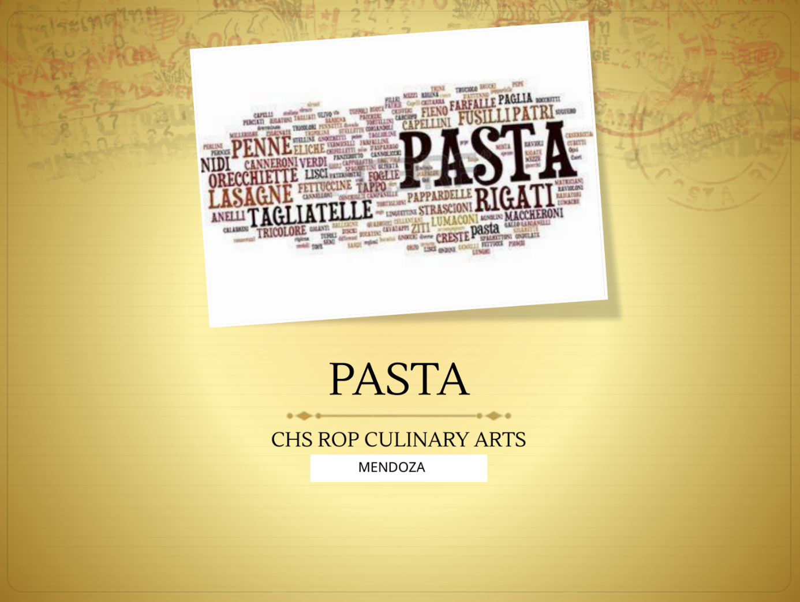
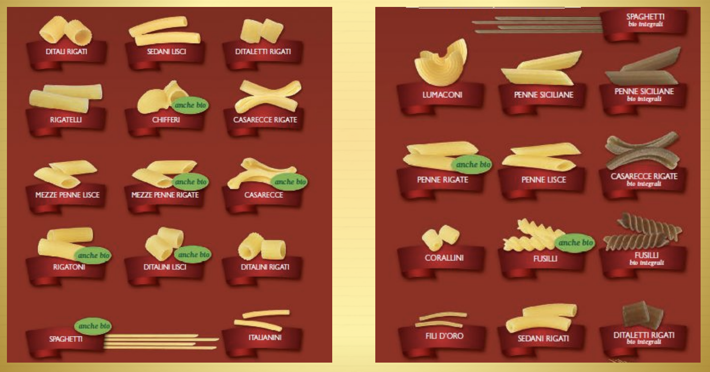

# Part 1
## Pasta
- Pasta is a starchy food that is made from grains.
- It is considered a staple in many commercial kitchens.
- Increases in volume as it cooks and yields a high profile.
- Very popular menu choice.
- Can be used in place of other starchy foods in a meal.
- The shape of some pastas makes them ideal for certain
sauces.
- You can buy pasta dried or fresh, but fresh pasta cooks
faster.
- There are more than 100 varieties of pasta available in a number of shapes, sizes, and colors.
- A pasta’s color reflects its flavor.
- One of the main ingredients in pasta is flour. The other main ingredient in pasta is a liquid, such as water or eggs. Oil is sometimes added to pasta dough to give it a richer texture.
- Most commercial dried pastas are made from semolina flour, a hard grain wheat flour that is high in the proteins that form gluten. Semolina flour produces a smooth dough and creamy yellow color.
---
## Common Types of Pasta

---
# Quality Characteristics of Pasta
#### 2 ways to determine the quality of pasta used in foodservice operations:
- Flour – Semolina, a high-protein flour, produces the best dry pasta. Dry pasta should contain 100% semolina flour.
- Freshness – Dry pasta should be hard and brittle. It should snap cleanly instead of bending easily.
---
## Purchasing and Storage
#### Dried Pasta:
- Often purchased in bags and boxes.
- Available in tube, flat, and shaped forms.
- Should not be brittle and should break easily.
- Surface should look dull, or be marked by small pits or scars. Sauces cannot soak into smooth, shiny, dried pasta.
- Comes in a variety of interesting and unusual flavors: plain, spinach, tomato, tomato-dill, spinach-herb, or carrot-ginger.
- Can be stored in a cool, dry place for several months.
- When storing dried pasta, temperatures in the storage area should be between 50* F – 70* F.
#### Fresh Pasta:
- Fresh pasta can be made in the kitchen, but it requires a great deal of labor to produce. It can also be difficult to get a consistent product.
- Can be purchased fresh or frozen.
- Comes in a variety of flavors: spinach, tomato-garlic, and whole-wheat.
- Must be wrapped tightly and kept refrigerated to prevent it from drying out.
- Even when refrigerated, fresh pasta should be used within a few days after it has been made.
- Can be kept in the freezer to be used within a few weeks.