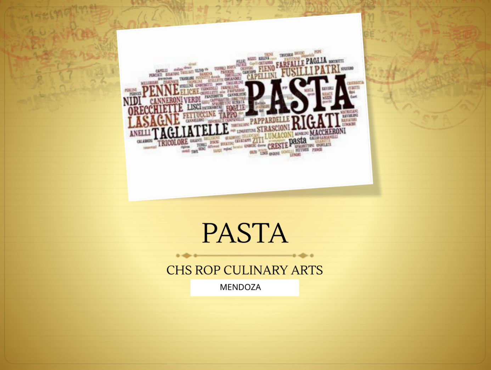
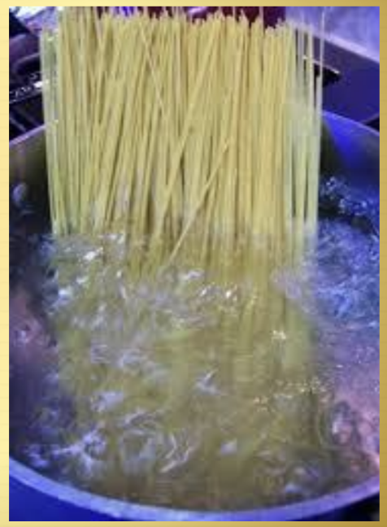
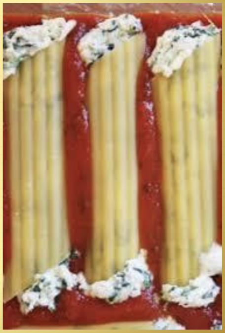

# Part 2
## Cooking Pasta

- Cooking pasta is a simple process if you are practicing mise en place.
-  Some pasta dishes require the pasta to be fully cooked, others require the pasta to be partially cooked and added to a casserole along with a variety of other ingredients.
-  Pasta can be boiled or baked. Both fresh and dried pasta can be boiled.
-  Baked pasta is usually one of the main ingredients in a casserole dish, such as stuffed manicotti or lasagna.
-  When pasta is baked, the noodles are partially cooked first by boiling.
#### Baking Pasta:
- When pasta is baked with a filling and a sauce, the flavors blend during the baking process.
- Some types of pasta are cooked and then layered in a casserole with other ingredients for a hearty baked dish: lasagna, manicotti, cannelloni, and mac and cheese.
#### Boiling Pasta:
- You need to use enough water to cook it properly.
- Can be cooked in large amounts ahead of time.
- Dried pasta can be cooked ahead of time.
- Fresh pasta cannot be cooked ahead of time because it cooks quickly and becomes too soft.
#### How to Boil Pasta:
1. Use at least one gallon of water for each pound of pasta, in a large enough stockpot for the pasta to move around freely.
2. Add about 1 oz. of salt per gallon of water. The pasta will absorb the water and salt during the cooking process.
3. Bring the water to a full boil before adding the pasta.
4. Stir the pasta occasionally as it boils. This will keep the pasta from sticking together.
5. Test pasta for doneness.
6. Drain pasta into a colander.
7. If serving immediately, don’t rinse or cool the pasta. If serving the pasta later, rinse it with cold running tap water to stop the cooking process.

#### Determinding Doneness:
- When you cook Italian style pasta cook it “Al dente”, meaning that the pasta is tender, but still firm. If pasta is cooked past this stage it quickly becomes soft and mushy, which makes it very unappetizing.
- Each type of pasta has a different cooking time, if it is overcooked or undercooked, the dish being prepared can be ruined.
- It is important to check pasta carefully to stop the cooking process at the al dente stage.
- To check for doneness, you can bite into a piece of pasta, if it is tender but still firm it is done. Another alternative is to cut through a piece with a fork, if it cuts easily it is done. Remove it from the heat and drain it.
---
## Stuffing Pasta
- Once cooked, some pasta can be stuffed with ingredients. Tubular pastas, such as manicotti or cannelloni, are usually stuffed. Ravioli are stuffed squares, rounds or triangles.
- The filling ingredients may include cheese, meat, seafood, poultry, or vegetables. Fillings may be cooked or uncooked.
- Meat fillings must be completely cooked before stuffed into pasta, as the time it takes the pasta to cook may not be sufficient to cook the meat safely.
- Large tubular pastas are often only partly cooked in boiling water. The cooking process is finished while they are baked.
--- 
## How to Stuff Pasta
1. Determine the pasta to be used.
2. Prepare the pasta by cooking it in boiling, salted water.
3. Make the filling.
4. Drain the pasta. Shock it in cold water to stop the cooking process.
5. Ladle a small amount of sauce into the bottom of the pan.
6. Stuff the filling into the pasta.
7. Place the stuffed pasta into the baking dish and ladle a small amount of sauce over the filled pasta.
8. Bake as indicated on the recipe.

---
## Serving Pasta
-  Pasta should be served immediately. The side dishes and garnishes must be ready to plate and serve.
-  Some pasta dishes are served as main dishes and other are served as side dishes.
-  After serving, you can freeze leftover pasta by itself, though it freezes best in sauce.
